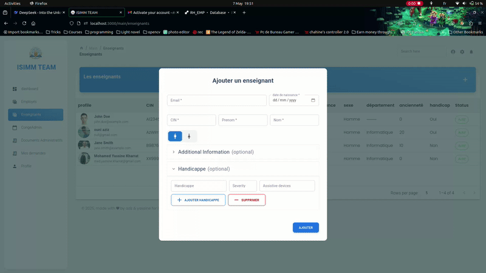
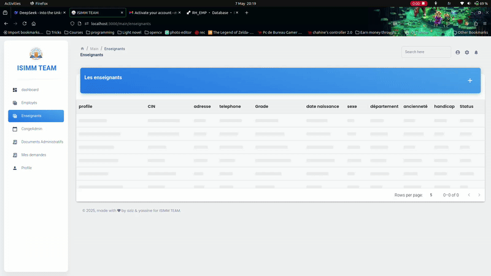

# Projet RH et Employé
## Sommaire
- Description
- Diffèrentes functionalité avec des captures d'ecrant
- l'avenir du projets
- Guide technique
    - Frontend 
    - Backend
## Description
Ce projet sert à répondre au cahier de charge proposé par monsieur Lazher.

Ce projet est une application web entière ayant comme frontend React +Mui et comme backend Quarkus Java, développé par Mohamed Aziz Ouni et Mohamed Yassine Kharrat

🔴: Admin et Personnel RH 
🔵: Les utilisateurs normals

## Differentes functionalités
### Gestion des enseignants
#### Ajouter l'enseignant 🔴
On peut ajouter un enseignant à la BDD, ce qui va envoyer un email, décrivant comment peut-il activer son compte.

#### Ajouter des handicappes 🔵🔴
Lors de l'ajout de l'enseignant, parfois on n'a pas un enregistrement de son handicap.
Pas de soucis car on peut l'ajouter en suivant les étapes décrits dans le vidéo ci-dessous.

#### Trier et filtrer les enregistrements 🔴
Le tableau affichant lea enseignants nous permets de les trier et les filtrer suivant des critères.

#### Afficher detailles enseignant 🔴
Bienque le tableau affiche plusieurs colonnes, il y a aussi d'autres qu'on ne peut pas visualiser dans un tableau simple.
Hereusement, en cliquant sur une ligne, on est redirigé vers une page détaillant l'enseignant ayant été sélectionné.

#### Modifier les détailles 🔴🔵
On peut modifier les détailles de chaque enseignant comme affiché dans le vidéo ci-dessous.
[Video clip]

L'enseignant lui-même peut modifier ses propres informations

#### Exporter l'état du congé de l'enseignant 🔴
On clique sur le 1er bouton à coté de l'entête "Congé". Cela va ouvrir un dialogue affichant un aperçu sur l'etat du congé de l"enseignant selectionné

#### Ajouter le solde d'un enseignant 🔴
Pour le moment, on peut ajouter le solde du congé d'un enseignant à cause de la contrainte du temps. Sinon, cette fonctionnalité n'est réservé que pour les employés.
On a juste implementé ça pour l'enseignant uniquement pour l'inclure dans notre projet.

### Gestion des congés
#### Afficher toutes les demandes du congé 🔴🔵

#### Ajouter une demande du congé

#### Afficher ses propres demandes du congé

#### Accepter ou réfuser le congé

### Auth
#### Activation compte

#### Login

#### Mot de passe oublié

## L'avenir du projet
Ce projet est ambitieux. Il y a beaucoups des détails cachés dans le backend, assurant les fonctionnalités mentionnées.
On vise à mettre ces détails en lumière, en ajoutant les functionalités suivantes au frontend:
CRUD des jours feriers
CRUD des Grad d'enseignant
CRUD des types de congé
CRUD des emploi du temps

À part ça, on peut aussi implementer les autres fonctionnalités restantes citées par le cahier de charge.

## Guide technique
[Execute tree on the project's root file structure and throw it to deepseek to make sense of it]